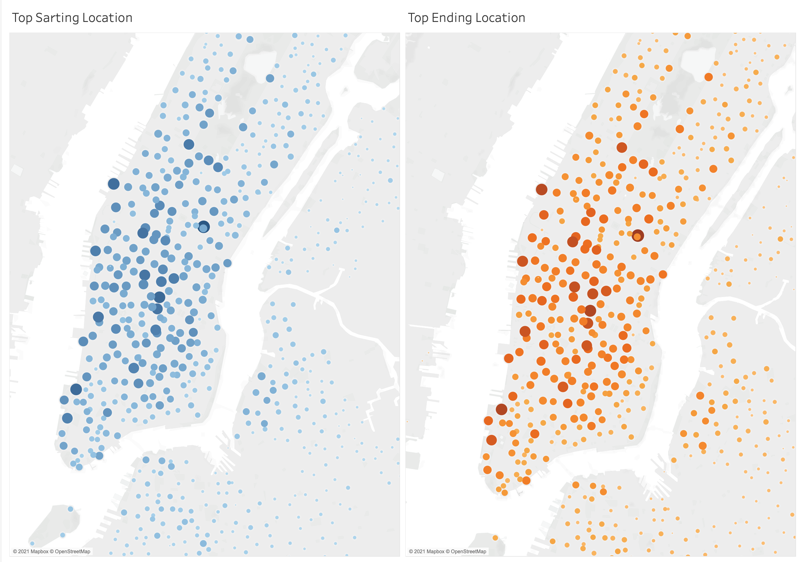
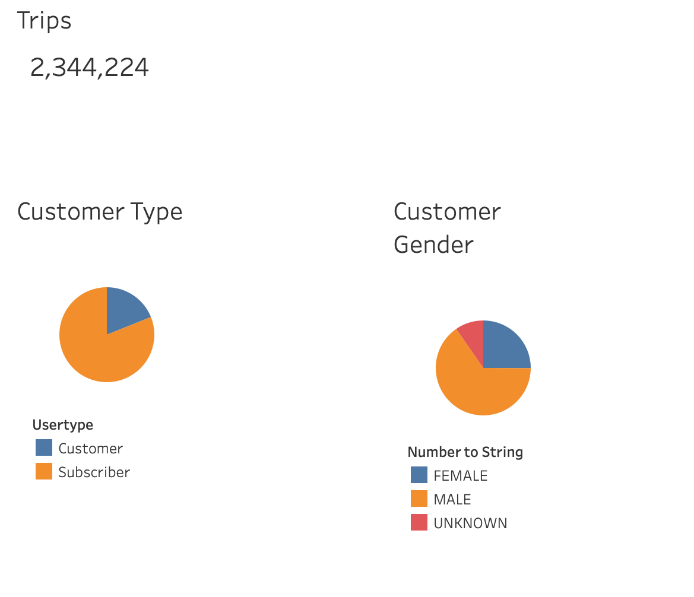
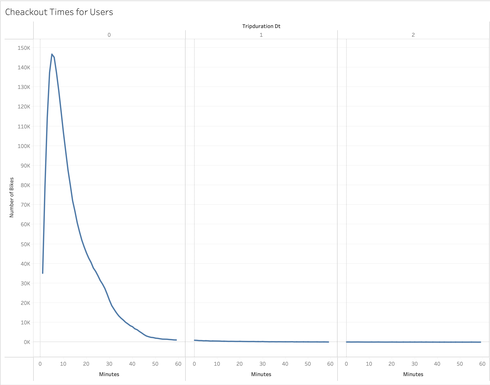
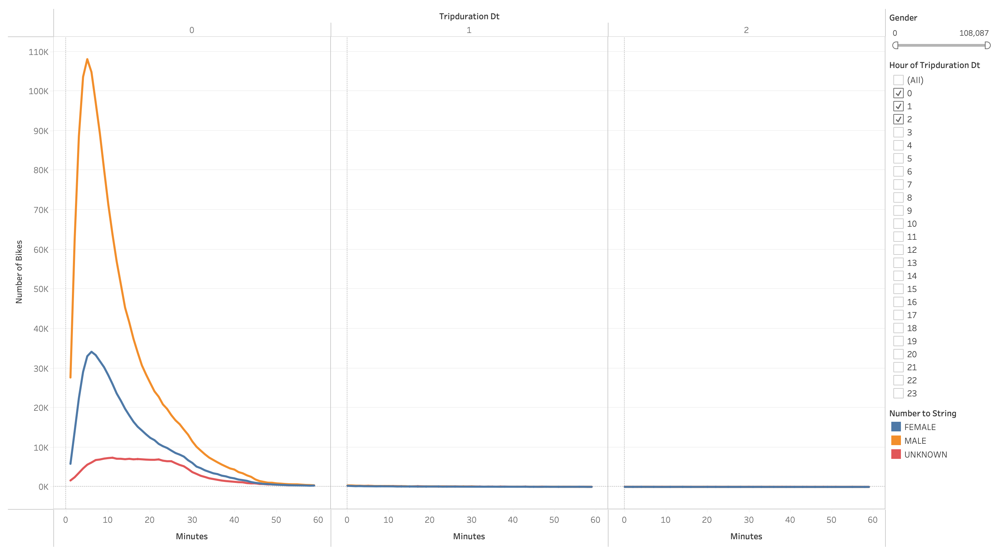
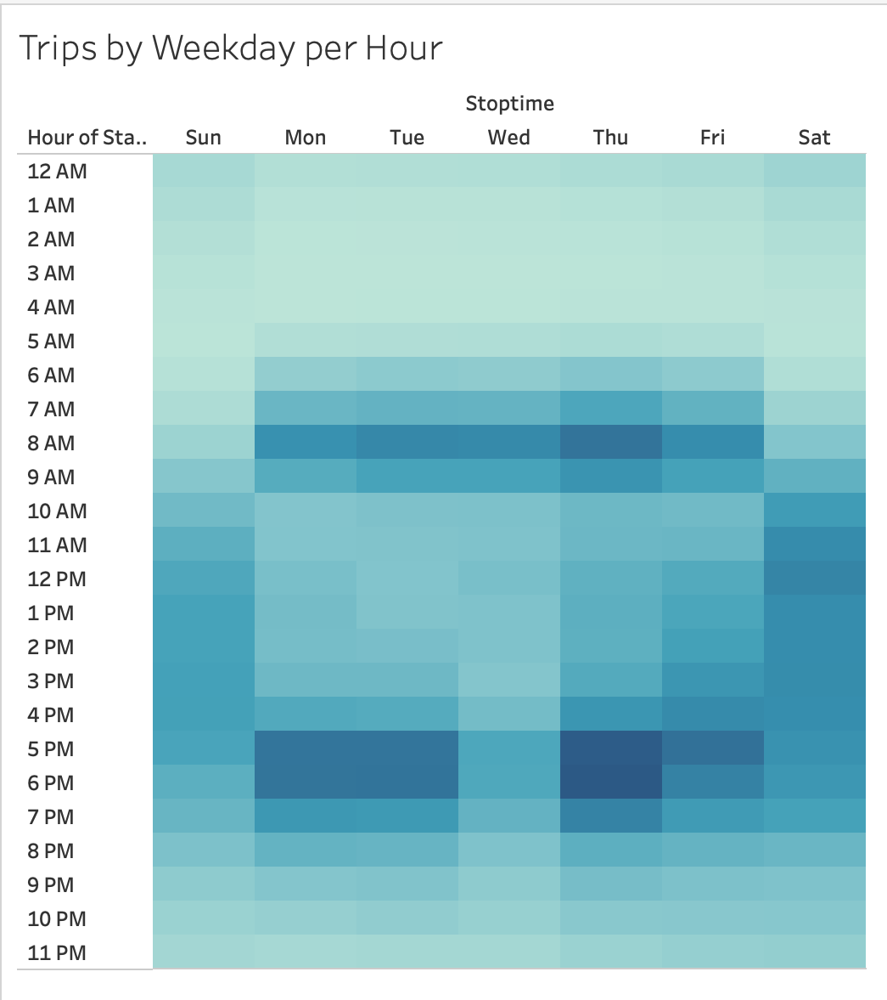
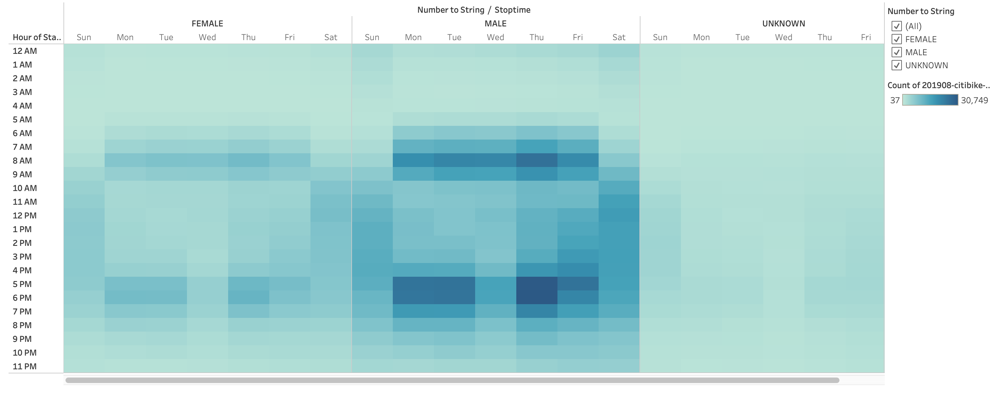
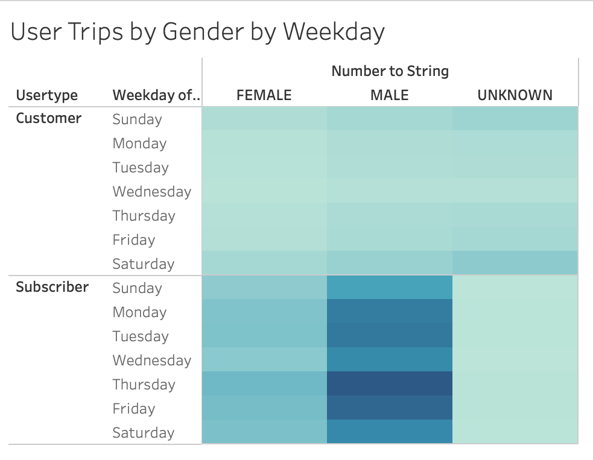

# **bikesharing**
*Use Tableau to perform analysis on NCY bike sharing data*

## Overview of Project:

#### *Purpose:*
The purpose of this project is to create a data driven story using Tableu. This story will be used in a final pitch presentation set to potential business investors. The business idea is to bring bikesharing to Des Moines. The following visulations were created using bikesharing data from NYC CitiBikes in August 2019.

## Results 

#### *Visualizations:*

1. Top Starting and Ending Locations 

2. Number of Trips, Customer Type, Customer Gender

3. Checkout Times for Users

4. Checkout Times by Gender

5. Trips by Weekday per Hour

6. Trips by Gender (Weekday per Hour)

7. User Trips by Gender by Weekday

## Summary:

The results from the above graphs show the active usage of Citi Bikes in NYC. From each visualization, investors can gain a better understanding of who the target market is, and how they will utilize the services in Des Moines. While Citi Bikes are used in residential areas, there is a cluster of higher usage in tourist/business districts.  The target customer is a male subscriber who bikes for less than 30min. during the week. The best time for bikes to be serviced for repairs would be between the early hours of 1:00 - 3:00AM. 

Additiaonal data analysis should be performed to further understand the cost of business. Visualizations such as determining bike utilization on NYC 2,344,224 trips and convergence of customer type. As additional data is visualized, the investors will have a compelling story matched with enthusiasm to bring bike sharing to Des Moines.     

[Link to Tableau Storyboard](https://public.tableau.com/app/profile/anna6479/viz/Book1NYC_CitiBike/NYCCitibikeStory)

